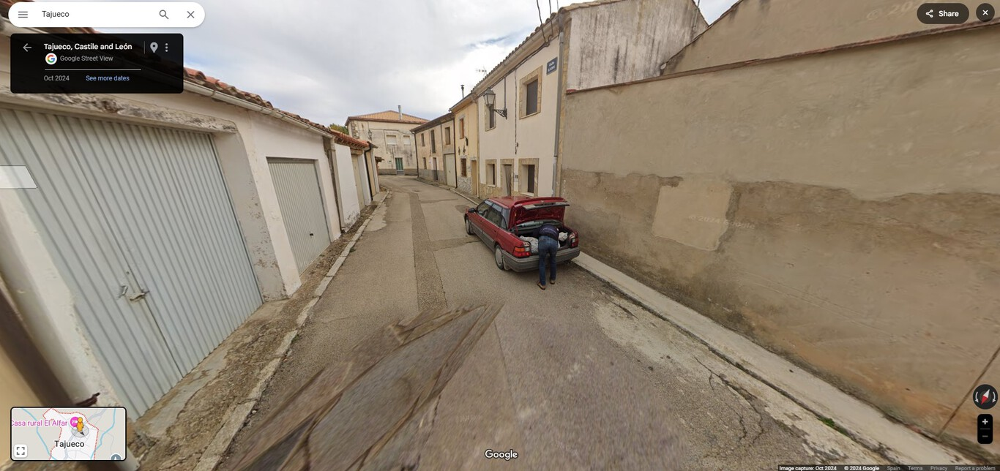

# Historical facts

## The king of the Dark Web

In the early 2010s, the Dark Web was gaining momentum. The promises of anonymity and privacy were attracting more and more people. With Bitcoin, there was a new form of payment that wasn't controlled by authorities. It had become easier than ever for criminals to sell their products online at a massive scale.

In July 2014, a man using the pseudonym "Alpha02" began developing AlphaBay. Just five months later, the platform went live. Initially, only stolen credit card data was offered and sold, but AlphaBay quickly began offering more lucrative products. In addition to data and logins, there were drugs, weapons, and malware. Services such as money laundering were also available. Few things were forbidden, but items or data related to child abuse, hit-and-runs, and stolen bank account information from Russia were strictly prohibited. Alpha02 probably wanted to avoid trouble with Russian law enforcement or perhaps wanted to mislead investigators by pretending to be Russian.

American investigators wanted to locate AlphaBay's servers. With access to the servers, they could shut down the platform or infiltrate it to locate the operators. They started browsing the platform and buying drugs anonymously, hoping for any mistakes by the sellers. Perhaps the product’s packaging or postage stamps could provide clues to the identity of the respective drug dealer, allowing them to arrest him. But these were just small fish. Dealers come and go. Investigators wanted Alpha02. However, the mastermind behind AlphaBay seemed to take every precaution and knew every rule of the game. Investigators became desperate until December 2016. Robert Miller, working for the DEA in Fresno, California, received an anonymous email. It seemed like Alpha02 had made a fatal mistake in the early days of AlphaBay. Every user who registered on the website at that time received a welcome email. The sender's email address was visible in the metadata of this email. Although the error was immediately corrected, the anonymous tipster saved one of those first welcome emails. Perhaps the tipster was one of Alpha02's first customers or an operator of a competing site. Regardless, he silently watched AlphaBay grow on the dark web, only to then hand the email address over to the DEA. The email address was pimp_alex_91@hotmail.com.

Via the email address, the investigators found photos from 2008 and 2009 of an "Alex" on Skyrock.com, a French-language social media platform. He also linked an old dating profile, listing Trois-Rivières as his hometown in southern Quebec, Canada. According to the profile, he was 17 years old at the time. So the 91 in his email address could be the year he was born. He would have been 23 years old when AlphaBay was founded. The username "Alpha02" also appeared on a French-language technology forum. They found Caze's PayPal account, which provided his private email address. Through his LinkedIn profile, they discovered he worked as a freelance software designer and ran his own tech company called EBX Technologies. On Facebook, the investigators found the profile of his fiancée, a Thai woman, indicating the Canadian lived in Thailand. The clues led investigators to Bangkok.

The date of the operation was set for July 5, 2017. Thai police blocked the area around the gated community in the early morning. The agents watched Cazes' house and waited for the right moment. When Cazes heard the crash, he left his laptop and went out to see what happened. The investigators stormed the house. Cazes' laptop was unlocked, and the DEA quickly gained access to the administration tools of AlphaBay. Simultaneously, other agents searched his "Bachelor Pad." Cazes was arrested without putting up a fight.

The investigators handed the suspect over to the Thai police. He was initially held at the police station and then transferred to Bangkok's Narcotics Suppression Bureau for questioning. He signed the arrest report at around 9:00 pm. But what was even more surprising was the morning of July 12, when Thai police found the body of Alexandre Cazes. The 25-year-old had taken his own life in his cell.

However, the investigators had what they wanted. They found incriminating evidence on his devices. They even found the password to his accounts in a text file. Using Cazes' laptop, they accessed AlphaBay's server and took control of the platform [[5]](./references.md#5).

## Facebook and Cambridge Analytica

Donald Trump’s 2016 presidential campaign was deeply linked to a major privacy scandal involving the political consulting firm Cambridge Analytica, which collected data from up to 87 million Facebook profiles. The connection between the two originated when Steve Bannon, who would later become Trump’s chief strategist, approached conservative donors Rebekah and Robert Mercer to finance the company. Bannon, serving as the firm’s vice president, was the one who introduced Cambridge Analytica into the campaign team.

Behind Cambridge Analytica was the SCL Group, a messaging and public relations agency that functioned as the firm’s real operational structure. SCL Group used unsettling language to describe its capabilities, boasting of expertise in “psychological warfare” and “influence operations.” Its business model was based on the premise that a sophisticated understanding of human psychology made it possible to identify and persuade individuals to accept the messages preferred by its clients.

The method used to obtain this vast amount of information was through researcher Aleksandr Kogan, who created a quiz application within Facebook. The most critical aspect of this process was the exploitation of a legal loophole in Facebook’s API, which allowed not only the collection of data from users who took the quiz, but also from all of their friends on the platform without their knowledge. Although Facebook prohibited the sale of data obtained through this method, Cambridge Analytica sold and used it anyway.

In addition to data collection, it was reported that the firm’s CEO, Alexander Nix, attempted to contact Julian Assange of WikiLeaks to obtain information about hacked emails from the Democratic National Committee. Mark Zuckerberg, Facebook’s CEO, later admitted that the company had made mistakes. However, former employees pointed out that there was a constant internal tension within Facebook, where revenue-generating teams often won internal disputes over security teams seeking to protect users.

Finally, the scandal caused Cambridge Analytica to lose multiple clients and face such severe negative publicity that the firm was forced to shut down its operations. This event cast doubt on Facebook’s ability to protect user privacy, as it allowed a third party to design an application with the sole purpose of extracting data on a massive scale [[6]](./references.md#6).

## The crime solved by Google Street View

In a small village in Spain (Tajueco), an image captured by a Google Street View car played an unexpected role in a police investigation. The photo, taken in October 2024, showed a man leaning over the trunk of a car while placing a large bundle—suspiciously resembling a body—inside it. That image reached the National Police, who used it as one of several clues to make progress in a disappearance case dating back to November 2023.

The investigation began when a family member reported the disappearance of a man of Cuban origin. Suspicious messages sent from his phone led investigators to believe that something was wrong, prompting the opening of a formal investigation.

Thanks to the follow-up of the photo, authorities identified and arrested two individuals on November 12: the victim’s partner and her former romantic partner, who were allegedly involved in the crime [[7]](./references.md#7).