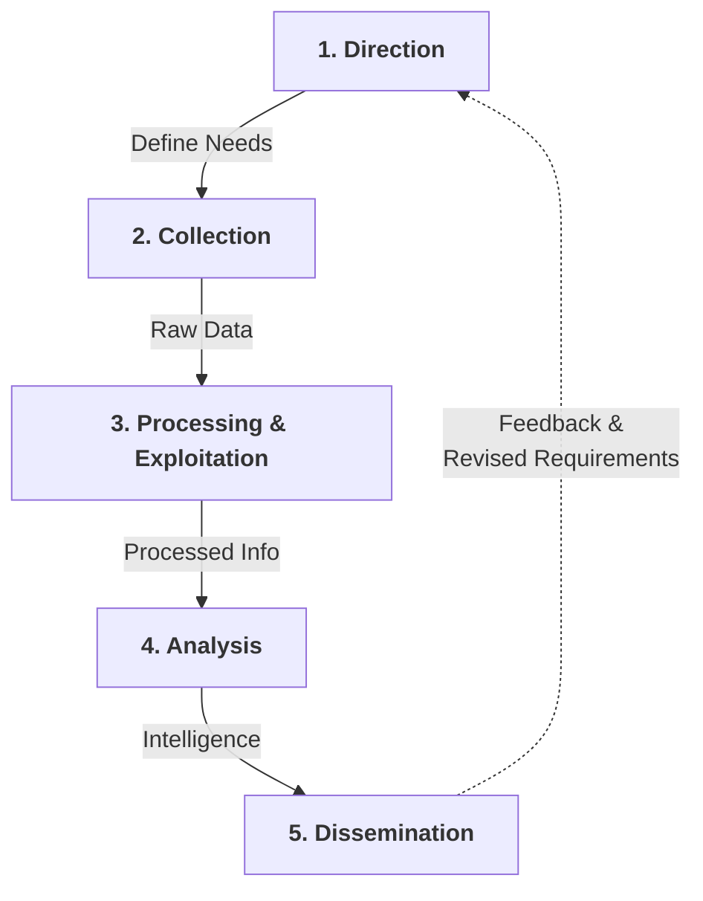

# Intelligence cycle

## Concept

The intelligence cycle is an idealized model of how intelligence is processed in civilian and military intelligence agencies, and law enforcement organizations. It is a closed path consisting of repeating nodes, which (if followed) will result in finished intelligence. The stages of the intelligence cycle include the issuance of requirements by decision makers, collection, processing, analysis, and publication (e.g., dissemination) of intelligence [[4]](../references.md#4).

## Phases

The intelligence cycle is composed of these phases:

1. **Direction:**  
  Intelligence requirements are determined by a decision maker to meet their objectives.

2. **Collection:**  
  In response to requirements, an intelligence staff develops an intelligence collection plan applying available sources and methods and seeking intelligence from other agencies. Collection includes inputs from several intelligence gathering disciplines, such as HUMINT (human intelligence), IMINT (imagery intelligence), ELINT (electronic intelligence), SIGINT (signals intelligence), OSINT (open source, or publicly available intelligence), etc.

3. **Processing and Exploitation:**  
  Once the collection plan is executed and the data arrives, it is processed for exploitation. This involves translation of raw intelligence materials from a foreign language, evaluation of relevance and reliability (e.g., with the Admiralty Code [[3]](../references.md#3)), and collation of the raw data in preparation for exploitation.

4. **Analysis:**  
  Analysis establishes the significance and implications of processed intelligence. It integrates information by combining disparate pieces of data to identify collateral information and patterns, then interprets the significance of any newly developed knowledge.

5. **Dissemination:**  
  Finished intelligence products take many forms depending on the needs of the decision maker and reporting requirements.

The intelligence cycle is a closed loop; feedback is received from the decision maker and revised requirements issued.

